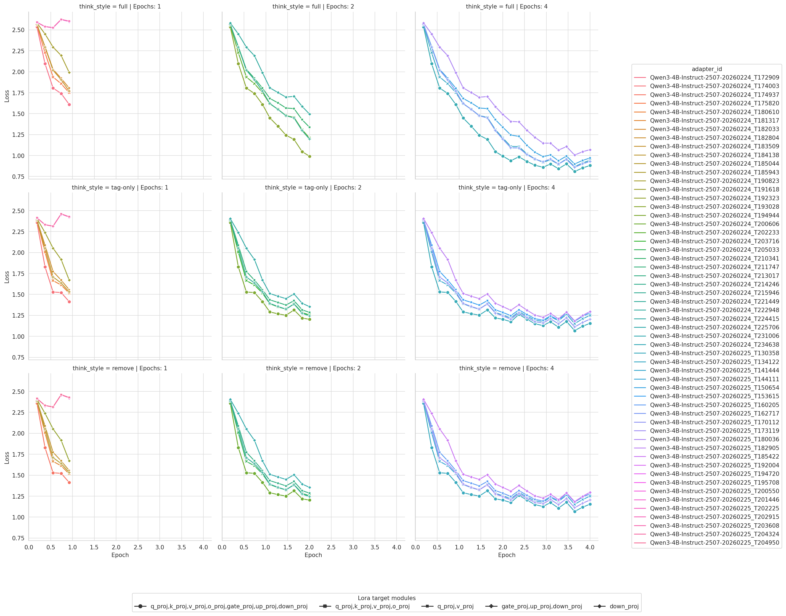

# LLM2025

東京大学松尾・岩澤研究室主催講座[大規模言語モデル講座(LLM)2025 応用編](https://weblab.t.u-tokyo.ac.jp/large-language-model-advanced-course/)の最終課題コンペティション用の、LLMの事後学習（SFT）と事後学習済みLLMの推論を行うプログラム集

本レポジトリは、上掲のコンペティション用に配布されたJupyter Notebookを、Pythonプログラムとして書き直したものである。特に、テスト用Pythonライブラリ`pytest`を用いることで、LLM事後学習時の各種ハイパーパラメータ（実験条件）を複数種類設定しておけば、`uv run python -m pytest -s -v -x`というコマンドの実行1回だけで、全条件下でのモデルの事後学習からHugging Faceへのアップロードを自動的に連続して行えるようにした。実際に、50個以上のモデルをこのコマンド1つで作成した。

LLM学習の実験管理に`pytest`を使う発想は、下記の資料に触発されたものである。

- [[堅牢.py #1] テストを書かない研究者に送る、最初にテストを書く実験コード入門 / Let's start your ML project by writing tests](https://speakerdeck.com/shunk031/lets-start-your-ml-project-by-writing-tests)
- [shunk031/pytest-ml-tdd-example](https://github.com/shunk031/pytest-ml-tdd-example)
- [pytestを活用したテスト駆動開発 - 人工知能応用特論Ⅰ 第7回](https://www.docswell.com/s/2625216247/5EY3VN-2025-11-27-194038)

## 本レポジトリ利用の準備

1. 本レポジトリを実行する計算機への本レポジトリのクローン
    ```bash
    git clone <URL_OF_THIS_REPO>
    ```
2. 本レポジトリを実行する計算機への[uvのインストール](https://docs.astral.sh/uv/getting-started/installation/)
3. 本レポジトリをクローンしたディレクトリのルートディレクトリで、本レポジトリの依存パッケージのインストール
    ```bash
    uv venv --python 3.12.12
    source .venv/bin/activate
    uv sync
    ```
4. 各種環境変数の設定（下記をターミナルで実行した後で、.envファイル上の環境変数を設定）
    ```bash
    cp .env.example .env
    ```

## モデルの事後学習

### 学習実行方法

1. tests/test_01_sft.pyに`@pytest.mark.parametrize`という関数が複数個ある。現在は、以下を設定できる。
    - think_style
    - max_seq_len
    - lora_r
    - lora_alpha
    - lora_target_modules
    - lora_dropout
    - num_train_epochs
    - lr
それぞれの`@pytest.mark.parametrize`の`argnames`の値を確認したうえで、その`argnames`の条件で試したいハイパーパラメータの値を対応する`argvalues`内のリストに1つ以上記入する。たとえば、`num_train_epochs`（エポック数）を1・2・4回のいずれかで試したい場合は、下記のように記入する。
    ```python
    @pytest.mark.parametrize(
        argnames="num_train_epochs",
        argvalues=[
            1,
            2,
            4,
        ],
    )
    ```
1. `@pytest.mark.parametrize`の調整が完了したら、本レポジトリのルートディレクトリで以下を実行する。
    ```bash
    uv run python -m pytest -s -v -x
    ```

### 途中で止まった場合の再開方法

```bash
uv run python -m pytest -s -v -x --lf tests/test_01_sft.py
```

```bash
# 前回の実行状況を確認
uv run python -m pytest --cache-show

# lr=1e-06 のテストだけ実行
uv run python -m pytest -s -v -x -k "1e-06" tests/test_01_sft.py

# lr=0.0006, epochs=4 のテストだけ実行
uv run python -m pytest -s -v -x -k "0.0006-4" tests/test_01_sft.py

# lr=1e-6 を除外して残り全部を実行したい場合
uv run python -m pytest -s -v -x tests/test_01_sft.py -k "not 1e-06"
```

### 実験条件の順序

pytest の `@pytest.mark.parametrize` を複数スタックした場合、テストIDには 関数に近い（下の）デコレータから順に値が並ぶ。ソースコードの行が関数から近い順ともいえる。

- https://docs.pytest.org/en/stable/how-to/parametrize.html
- https://github.com/pytest-dev/pytest/issues/4853

### 学習状況（学習率の低下度合い）の可視化

全実験条件でのモデルの学習が終わった後で以下のコマンドを使うことにより、各条件での学習率の低下度合いを一望できる

```bash
uv run python analyse_training_process.py
```



## 事後学習後モデルによる推論

### 推論実行方法

```bash
uv run python inference.py
```
